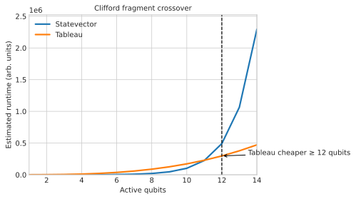
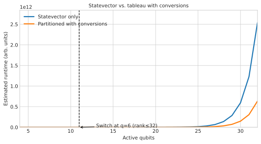
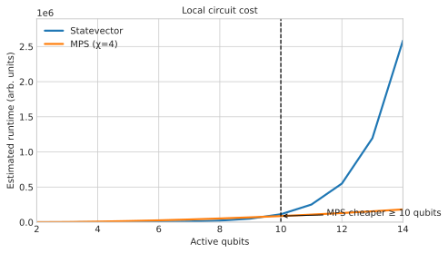
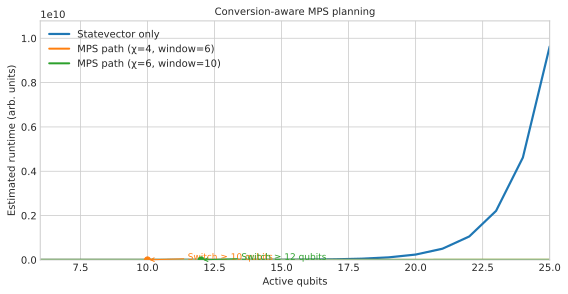
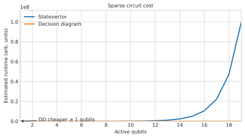
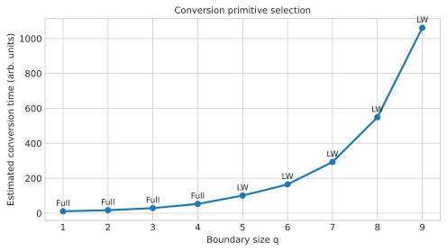
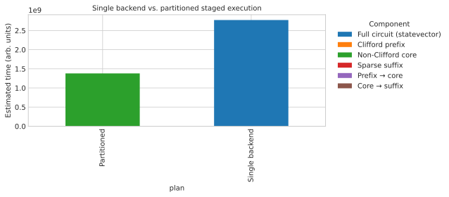

# Partitioning Theory Reference

This note consolidates the analytical assumptions already documented in the
project, captures the thresholds and decision heuristics embedded in the
planner, and outlines the data required for a theoretical calculator that can
replicate QuASAr's partitioning choices.

## Notebook workflow

### Environment setup

1. Install QuASAr in editable mode together with its testing extras so the
   cost-model helpers and planner logic used inside the notebook are importable::

       pip install -e .[test]

2. Add a Jupyter frontend if it is not already available.  Any of
   ``jupyter lab``, ``jupyter notebook`` or ``jupyter nbclassic`` works::

       pip install jupyterlab

3. Launch Jupyter from the project root and open
   ``docs/partitioning_thresholds.ipynb``::

       jupyter lab docs/partitioning_thresholds.ipynb

   Running the notebook from the repository root ensures relative imports such as
   ``from quasar.cost import CostEstimator`` resolve correctly without adjusting
   ``sys.path`` inside the notebook cells.

### Calibration inputs

The notebook reads the same coefficient tables consumed by
``quasar.cost.CostEstimator`` so that the plotted cross-overs match the planner's
runtime predictions.  Calibration utilities live in ``quasar/calibration.py`` and
produce JSON files under ``calibration/``.  Two entry points are available:

* ``python -m quasar.calibration --output calibration/coeff_dev.json`` runs the
  lightweight microbenchmarks and writes a fresh coefficient table.
* ``python tools/benchmark_coefficients.py`` wraps the same workflow and stores
  timestamped snapshots (``calibration/coeff_v*.json``).

Placing a JSON file in ``calibration/`` lets ``latest_coefficients()`` load it
automatically.  The notebook can also ingest a specific file by calling
``load_coefficients(path)``.

### Overriding coefficients for hardware assumptions

To explore alternative hardware, start from an existing JSON table and edit the
coefficients that capture backend throughput, baseline costs or memory pressure.
The snippet below mirrors the logic used by the planner and keeps the notebook in
sync with runtime decisions::

    from quasar.calibration import load_coefficients, apply_calibration
    from quasar.cost import CostEstimator

    estimator = CostEstimator()
    coeff = load_coefficients("calibration/coeff_dev.json")
    coeff["sv_gate_2q"] *= 0.8   # pretend improved two-qubit fidelity
    apply_calibration(estimator, coeff)

The modified ``estimator`` exposes the adjusted parameters via
``estimator.coeff`` so notebook cells can reuse them when evaluating analytic
curves.  Saving the dictionary back to disk (``save_coefficients``) retains the
custom assumptions for later experiments.

## Existing analytical assumptions

### Cost model formulas

`docs/cost_model.md` defines backend-specific runtime and memory expressions
parameterised by calibration coefficients. The current assumptions are:

* **Statevector:** Runtime grows linearly with the amplitude count and the
  calibrated per-gate costs, while memory is proportional to ``2^n`` times the
  effective bytes per amplitude (``sv_gate_*``, ``sv_meas``,
  ``sv_bytes_per_amp``). Baseline time and memory offsets capture simulator
  initialisation overheads.
* **Tableau:** Clifford fragments cost ``O(N n^2)`` operations with additional
  quadratic memory and per-measurement storage (`tab_*` coefficients).
* **Matrix product state:** Gate costs scale with the local tensor footprint
  ``l_i r_i`` and bond dimension ``χ``; truncation and temporary buffers are
  optional polynomial terms (`mps_*`).
* **Decision diagram:** Runtime and memory both scale linearly with the active
  node/frontier count ``r`` using coefficients `dd_gate`, `dd_mem`,
  `dd_node_bytes`, and cache overhead.
* **Conversions:** Boundary-to-boundary (B2B), local window (LW), staged (ST),
  and full extraction primitives are expressed as polynomials in boundary size
  ``q``, Schmidt rank ``s``, frontier width ``r`` and the optional LW window
  ``w``. Fixed ingestion and conversion base terms (`ingest_*`,
  `conversion_base`) approximate backend switching overheads. See
  [conversion_primitives.md](conversion_primitives.md) for the detailed
  parameter glossary.

These expressions depend entirely on calibrated constants; no stochastic terms
or hardware counters are incorporated in the analytical layer.

### Partitioning threshold notebook

`docs/partitioning_thresholds.ipynb` documents how partitioning decisions are
modelled today:

* Planner decisions are derived by growing a fragment until the cheapest backend
  (according to the cost model) changes. Each backend comparison uses the
  analytic expressions above.
* Example cross-over plots assume fixed per-qubit gate densities (e.g., ten
  Clifford gates per qubit for tableau vs. statevector, five gates per qubit and
  ``χ=4`` for the MPS example). These simplifications highlight qualitative
  trends but do not yet cover heterogeneous depths, non-local interactions, or
  adaptive ``χ`` estimates.
* Conversion primitives are chosen by comparing the polynomial cost models for a
  boundary of size ``q`` (and associated ``s``, ``r``, ``w`` parameters) without
  feeding back empirical conversion traces; see the worked examples in
  [conversion_primitives.md](conversion_primitives.md).

The notebook therefore captures the *shape* of the thresholds but omits how the
planner's heuristics (sparsity checks, locality tests, rank limits) interact
with these curves.

#### Exported calibration-aligned figures

`docs/partitioning_thresholds.ipynb` now uses the reusable helpers in
`docs/utils/partitioning_analysis.py` to load the latest coefficient snapshot
(`calibration/coeff_v1.json`) via :func:`load_calibrated_estimator`. Each plotting
cell applies a shared Seaborn/Matplotlib style, annotates backend cross-over
points, and exports SVG figures to ``benchmarks/figures/partitioning/`` so they
can be embedded directly in the documentation (additional formats can be
requested ad-hoc when running the notebook locally). The current calibrated
outputs are shown below:

*Figure 1 – Tableau becomes cheaper for Clifford fragments beyond the highlighted qubit count when evaluated with the calibrated coefficients.*

*Figure 2 – The planner's conversion-aware preference for switching to tableau once the boundary and rank (derived from `calibration/coeff_v1.json`) keep conversion costs under control.*

*Figure 3 – Local MPS execution overtakes dense simulation at the annotated qubit count using the calibrated gate densities.*

*Figure 4 – Including statevector↔MPS conversion costs highlights when higher-χ paths become favourable according to the calibrated conversion coefficients.*

*Figure 5 – Decision-diagram execution windows for sparse circuits using the current `coeff_v1` sparsity thresholds.*

*Figure 6 – Conversion primitive choices as a function of boundary size mirroring the planner’s primitive selection heuristics.*

*Figure 7 – Aggregated fragment and conversion costs for a staged plan, directly derived from the calibrated cost model.*

## Implemented decision metrics

### MethodSelector heuristics

`quasar/method_selector.py` evaluates multiple circuit properties before it ever
consults the cost model:

* **Clifford detection:** Fragments consisting solely of gates in the
  `CLIFFORD_GATES` set are routed to the tableau simulator when permitted,
  subject to the global memory and time limits.
* **Decision diagram suitability:** The selector computes sparsity, phase
  rotation diversity, amplitude rotation diversity, and the implied non-zero
  amplitude count. Decision diagrams are considered only when all of the
  following hold:
  - Sparsity exceeds the adaptive threshold `adaptive_dd_sparsity_threshold(n)`.
  - The non-zero amplitude estimate `nnz` stays below
    `config.DEFAULT.dd_nnz_threshold` (1,000,000 by default).
  - Phase and amplitude rotation diversities are below their respective limits:
    `config.DEFAULT.dd_phase_rotation_diversity_threshold` (16) and the
    adaptive amplitude rotation threshold derived from
    `config.adaptive_dd_amplitude_rotation_threshold`.
  - A weighted metric combining sparsity, `nnz`, phase diversity, and amplitude
    diversity meets `config.DEFAULT.dd_metric_threshold` (0.8 by default). Each
    component weight is configurable (`dd_*_weight`).
* **Locality check for MPS:** The fragment must contain at least one multi-qubit
  gate and every multi-qubit gate must act on adjacent qubits; otherwise MPS is
  rejected.
* **MPS bond dimension limits:** The selector derives a candidate bond dimension
  from `CostEstimator.chi_for_constraints`, respecting optional accuracy and
  memory caps. If the implied `χ` exceeds the limit, the backend is marked
  infeasible.
* **Statevector fallback:** Dense simulation is always evaluated when resource
  constraints permit it. Once a fragment commits to statevector execution, the
  partitioner keeps that backend for the remainder of the fragment to avoid
  oscillations (`statevector_lock`).

### Partitioner trace data

`quasar/partitioner.py` orchestrates fragment construction and records the
inputs needed to reason about partition boundaries:

* **Metric gathering:** For every candidate fragment the partitioner evaluates
  sparsity, phase rotation diversity, and amplitude rotation diversity via the
  helper metrics in `quasar.sparsity` and `quasar.symmetry`.
* **Boundary forecasting:** It maintains a reverse scan of "future" qubits so it
  can predict the boundary size encountered when closing a partition.
* **Trace emission:** Whenever a backend change is considered, the partitioner
  logs a `PartitionTraceEntry` containing the gate index, boundary qubits and
  size, estimated Schmidt rank (`2**|boundary|` by default), decision-diagram
  frontier width, selected conversion primitive, and its estimated cost. The
  recorded fields (`boundary_size`, `rank`, `frontier`, `primitive`, `cost`)
  match the glossary in [conversion_primitives.md](conversion_primitives.md);
  the LW window parameter stays implicit and follows the estimator default when
  no override is supplied. This trace is available both via explicit callbacks
  and on the returned SSD when `debug=True`.
* **Conversion layers:** Accepted backend switches produce `ConversionLayer`
  records that persist the boundary tuple, source/target backends, rank,
  frontier, primitive, and conversion cost so the SSD retains the inputs needed
  for end-to-end resource estimation.
* **Graph-cut heuristic:** When enabled, `_select_cut_point` searches all
  possible cut indices inside the current fragment and scores them using a
  weighted combination of boundary size and load balance to minimise conversion
  overheads before the new backend is applied.

## Identified gaps

* The theoretical plots in the notebook do not incorporate the selector's
  sparsity or rotation diversity gates; they assume cost curves alone decide
  partition boundaries.
* Conversion rank estimates default to ``2**q`` based solely on boundary size,
  yet the cost model accepts external Schmidt rank and frontier inputs. A
  tighter estimator (e.g., using `CostEstimator.max_schmidt_rank`) is not wired
  into the trace yet.
* Locality checks are binary—either fully nearest-neighbour or rejected. There
  is no graded penalty for almost-local circuits, nor a mechanism to feed
  entanglement entropy into the backend choice.
* Calibration coefficients are consumed as opaque constants. There is no summary
  tying coefficient provenance, measurement recency, or uncertainty to the
  partitioning thresholds.

## Required inputs for a theoretical calculator

To reproduce planner decisions analytically we must gather the following inputs
for each candidate fragment and potential boundary:

* **Gate statistics:** Number of qubits, counts of 1-qubit, 2-qubit, and
  measurement operations, plus a Clifford-only flag.
* **Structural heuristics:** Estimated sparsity, phase rotation diversity,
  amplitude rotation diversity, non-zero amplitude count, and locality (adjacent
  two-qubit interactions).
* **Entanglement bounds:** Estimated Schmidt ranks across relevant cuts (e.g.,
  via `CostEstimator.max_schmidt_rank`) and optional entanglement entropy.
* **Boundary descriptors:** Size of the cut, explicit qubit indices, and—when
  available—refined Schmidt rank/frontier estimates beyond the default
  ``2**|boundary|``.
* **Conversion diagnostics:** The conversion primitive chosen by the estimator,
  its runtime/memory cost, any ingestion multipliers, and LW window overrides
  if the planner supplied them.
* **Calibration coefficients:** The current `CostEstimator` coefficient table and
  any policy caps (`s_max`, `r_max`, `q_max`, `chi_max`) that alter feasibility
  decisions.
* **Resource constraints:** External memory, runtime, and accuracy targets that
  influence backend eligibility.

## Data flow for the theoretical calculator

1. **Fragment analysis:** Derive gate counts and structural heuristics for the
   candidate fragment and evaluate feasibility guards (Clifford-only, DD metric,
   locality).
2. **Cost evaluation:** Feed the fragment statistics, entanglement bounds, and
   calibration coefficients into the backend cost equations to obtain predicted
   time and memory.
3. **Boundary evaluation:** For each potential cut, combine the boundary size,
   Schmidt rank/frontier estimate, and conversion coefficients to score the
   available primitives.
4. **Decision synthesis:** Apply the same priority rules as `MethodSelector`
   (tableau preference, DD metric threshold, MPS feasibility, statevector
   fallback) and pick the cheapest feasible backend, recording the supporting
   metrics and conversion plan.
5. **Trace integration:** Store the resulting backend choice, cost, and boundary
   diagnostics so later planners or auditors can replay the analytical decision
   without rerunning the full estimator.

## Interpreting notebook output alongside planner traces

The notebook visualises when the analytic cost curves in ``quasar/cost.py``
predict a backend change.  To compare those predictions with planner execution,
enable debugging on the runtime planner (``Planner(debug=True)`` or
``SimulationEngine(debug=True)``) so ``quasar/partitioner.py`` emits the
``PartitionTraceEntry`` sequence stored on :class:`~quasar.ssd.SSD.trace`.

When inspecting a trace entry ``entry``, align notebook predictions as follows:

* **Cut location:** The notebook's boundary size ``q`` corresponds to
  ``entry.boundary_size`` and the specific qubits reported in
  ``entry.boundary``.
* **Entanglement assumptions:** The theoretical Schmidt rank estimate maps to
  ``entry.rank`` while decision-diagram frontier predictions align with
  ``entry.frontier``.  Populate these fields from the notebook when exploring
  custom entanglement profiles.
* **Conversion primitive:** Notebook choices between B2B, LW, staged or full
  extraction should be compared with ``entry.primitive`` and its estimated
  ``entry.cost``; refer to [conversion_primitives.md](conversion_primitives.md)
  for the parameter mapping.
* **Backend transitions:** The predicted source/target backends match
  ``entry.from_backend`` and ``entry.to_backend``.  The ``entry.applied`` flag
  shows whether the planner committed to the switch after evaluating runtime and
  memory constraints.

This mapping keeps the analytical notebook, ``CostEstimator`` heuristics and
the recorded planner behaviour in sync, making it easier to reason about why a
particular backend was selected at runtime.

### Validating with real circuits

After correlating notebook predictions with trace data, validate key scenarios on
real circuits:

1. Build a :class:`~quasar.circuit.Circuit` and run ``Planner.plan`` or
   :class:`~quasar.simulation_engine.SimulationEngine` with ``debug=True`` to
   capture the emitted trace.
2. Compare observed ``PartitionTraceEntry`` boundaries against the notebook's
   crossover points.  Differences often indicate that additional heuristics in
   ``quasar/method_selector.py`` or hard resource limits capped by
   ``CostEstimator`` influenced the decision.
3. Feed measured runtime or memory back into the calibration workflow and update
   the coefficient table.  Re-running the notebook with the new calibration
   highlights whether the theoretical thresholds now mirror practice.

Developers extending the theory tool should revisit ``quasar/cost.py`` and
``quasar/partitioner.py`` whenever planner logic evolves so the documentation,
notebook assumptions and runtime traces continue to align.  Bridging the
documented assumptions with the concrete heuristics above provides clear targets
for the calculator implementation: expose the selector metrics, replace coarse
rank defaults, and thread calibration metadata through the partition trace so
theoretical analyses stay aligned with runtime behaviour.
