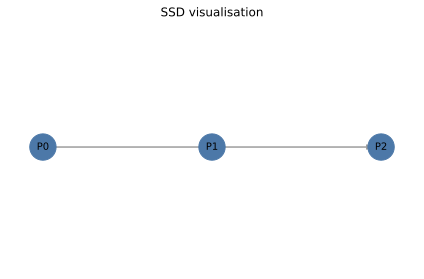

# SSD visualisation helpers

The utilities in [`tools/ssd_visualisation.py`](../tools/ssd_visualisation.py)
turn the graph returned by :meth:`SSD.to_networkx` into publication-ready
figures.  They position partitions, conversions and backends on
dedicated rows and provide highlight options for long-range entanglement
and large conversion boundaries.

## Rendering with Matplotlib

```python
import matplotlib.pyplot as plt
from quasar.circuit import Circuit
from quasar.ssd import SSD
from tools.ssd_visualisation import HighlightOptions, compute_layout, draw_ssd_matplotlib

circuit = Circuit(
    [
        {"gate": "H", "qubits": [0]},
        {"gate": "CX", "qubits": [0, 3]},
        {"gate": "CX", "qubits": [1, 2]},
        {"gate": "SWAP", "qubits": [2, 5]},
    ],
    use_classical_simplification=False,
)
ssd: SSD = circuit.ssd

graph = ssd.to_networkx(include_backends=True)
layout = compute_layout(graph)
options = HighlightOptions(long_range_threshold=2, boundary_qubit_threshold=2)

draw_ssd_matplotlib(graph, layout=layout, highlight=options)
plt.show()
```

The example above highlights the entanglement edge between partitions that
operate on distant qubits as well as partitions with a wide boundary.

## Interactive Plotly figure

```python
from tools.ssd_visualisation import HighlightOptions, draw_ssd_plotly

fig = draw_ssd_plotly(graph, layout=layout, highlight=HighlightOptions(
    long_range_threshold=2,
    boundary_qubit_threshold=2,
))
fig.show()
```

The Plotly backend retains node metadata as hover tooltips and can be
restricted to problematic regions by setting
``HighlightOptions(only_problematic=True)``.

## Example script

An executable demonstration is provided in
[`docs/examples/ssd_visualisation_example.py`](examples/ssd_visualisation_example.py).
Running the script will open a Matplotlib window highlighting the
long-range entanglement between distant qubits.

## Minimal partition-only layout

For a compact example that focuses purely on partition structure, the
[`docs/examples/ssd_visualisation_minimal.py`](examples/ssd_visualisation_minimal.py)
script constructs a three-gate circuit consisting of two disjoint
single-qubit fragments (`H` on qubit 0 and `RX` on qubit 2) and a single
entangling `CX` acting on qubits 0 and 1.  Invoking
``Circuit.ssd.to_networkx(include_conversions=False, include_backends=False)``
removes conversion layers and backend nodes so the resulting SSD clearly
shows how partitions connect.



In the rendered graph, partition ``P0`` represents the `H` gate on qubit 0
and feeds into partition ``P2`` that contains the `CX` gate on qubits 0 and
1, encoding the execution dependency introduced by the entangling
operation.  Partition ``P1`` captures the `RX` rotation on qubit 2 and
remains isolated because it manipulates a qubit that does not interact
with the other fragments.

Recreate the diagram with::

    PYTHONPATH=. python docs/examples/ssd_visualisation_minimal.py --output docs/data/ssd_visualisation_minimal.svg

The command emits the SVG used above, letting readers modify the circuit
or plotting parameters to explore other partitioning outcomes.

## Filtering problematic regions

Both rendering helpers accept :class:`HighlightOptions`.  Use the
``boundary_qubit_threshold`` field to highlight large interfaces between
partitions and conversions, and ``only_problematic`` to hide benign
regions.  Long-range entanglement (measured by the minimum distance
between qubit indices) is emphasised using the ``long_range_threshold``
field.

For larger SSDs consider serialising the graph to disk and loading it in a
notebook together with these utilities for interactive exploration.
